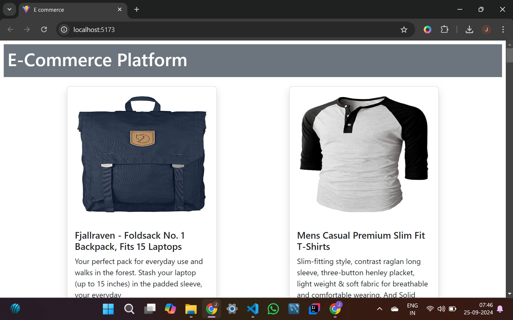
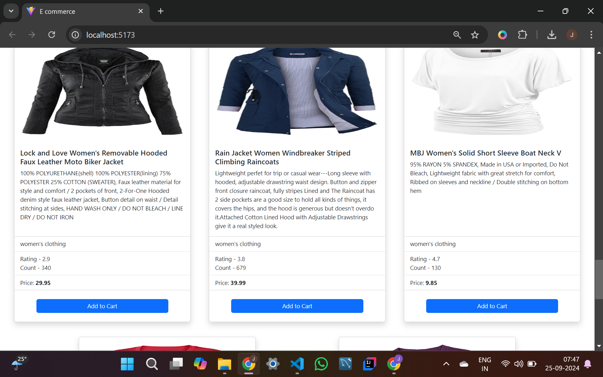
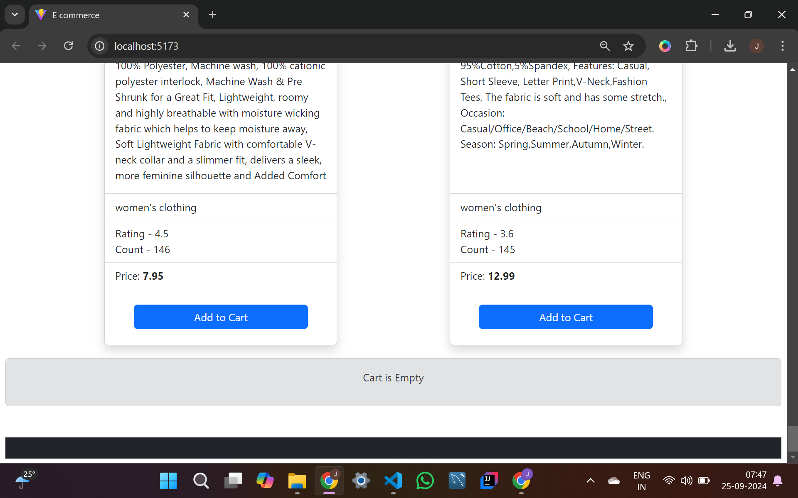
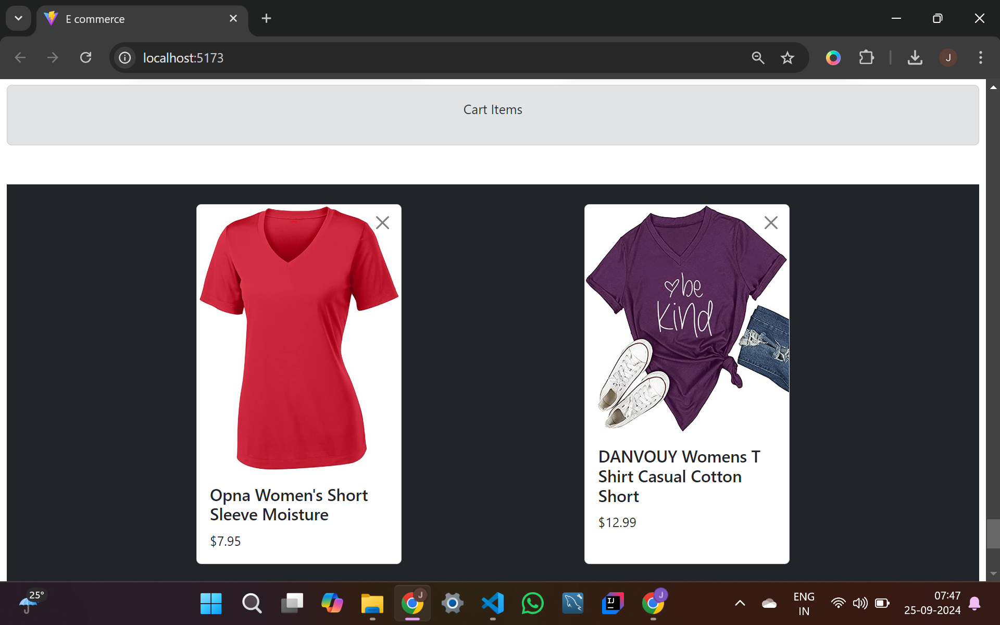
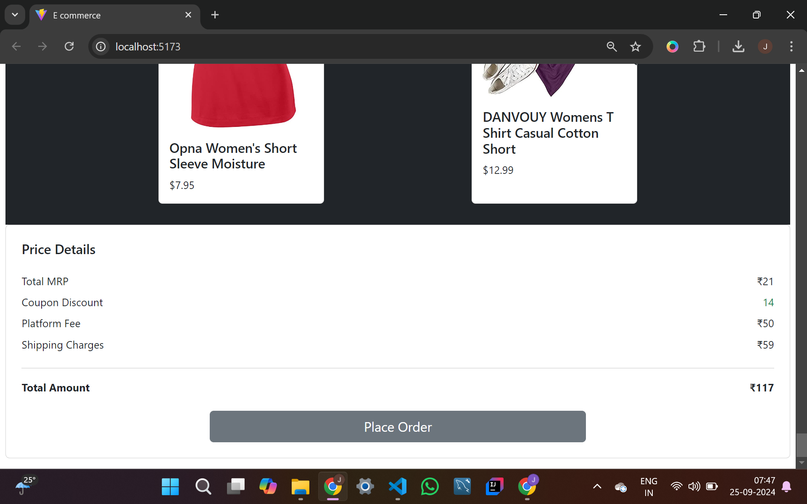
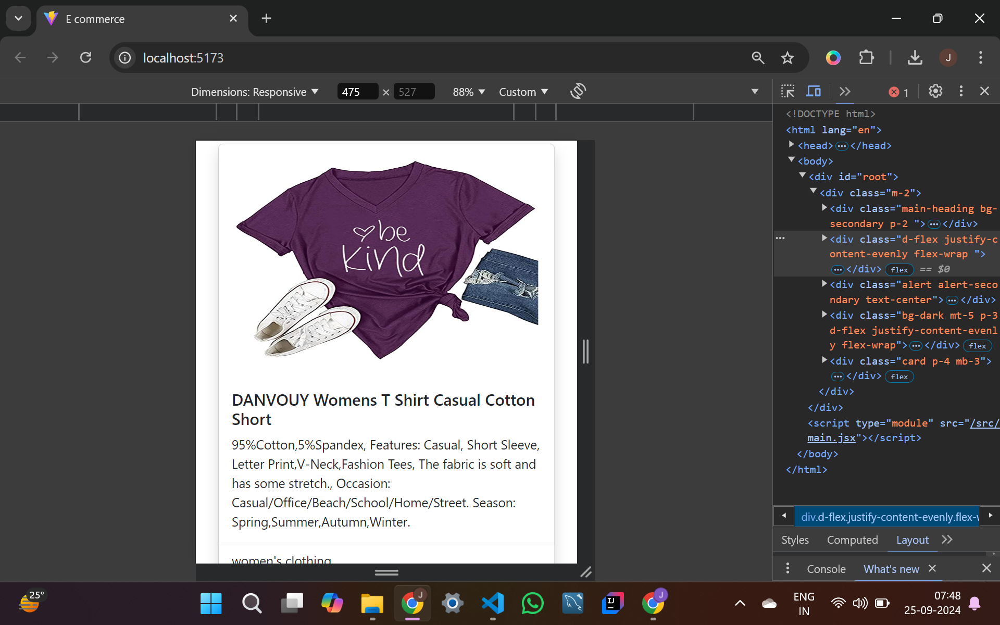
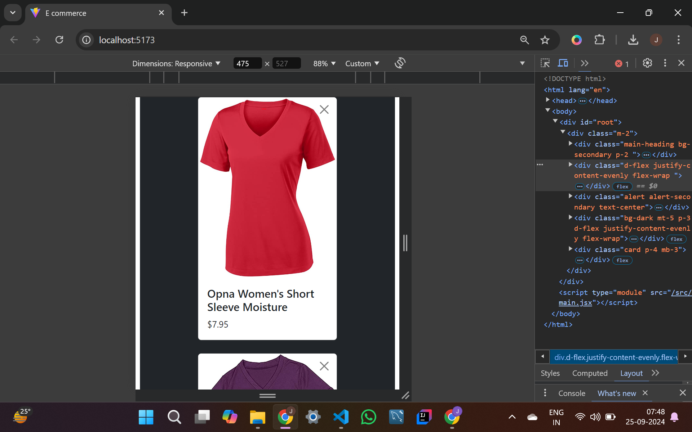
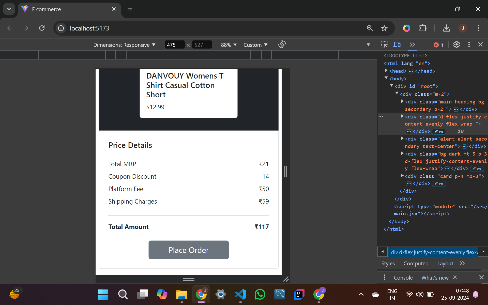

# GDSC-Assignment

A simple and responsive E-Commerce platform built using React. This project features a user-friendly interface for browsing products, managing a shopping cart, applying discounts, and placing orders.

## Table of Contents

- [Features](#features)
- [Technologies Used](#technologies-used)
- [Installation](#installation)
- [Running the Application](#running-the-application)
- [Folder Structure](#folder-structure)
  
## Features

- Product listing with detailed views
- Shopping cart with dynamic price updates
- Coupon and discount management
- Responsive UI with Bootstrap


## Technologies Used

- **React**: Frontend library for building UI
- **Vite**: Fast build tool for modern web projects
- **Bootstrap**: For responsive design and UI components

## Installation

1. Clone the repository:
   ```bash
   git clone https://github.com/Jeevan-36/GDSC-Assignment
   ```
2. Navigate to the project directory:
   ```bash
   cd gdsc-assignment
   ```
3. Install the dependencies:
   ```bash
   npm install
   ```

## Running the Application

To start the development server, use the following command:

```bash
npm run dev
```

The app will be available at `http://localhost:5173` or as specified by your Vite configuration.

## Folder Structure

```plaintext
gdsc-assignment/
│
├── public/              # Static files
├── src/
│   ├── components/      # Reusable React components
│   ├── assets/          # Images, fonts, and other static assets
│   ├── utils/           # Utility functions
│   ├── App.js           # Main app component
│   └── index.js         # Entry point
│
├── package.json         # Project configuration and dependencies
├── vite.config.js       # Vite configuration
└── README.md            # Documentation
```
## Screenshots

### Homepage


### Product Listings


### Initial Cart View


### Cart View


### Order Summary


### Responsive Check-1

### Responsive Check-2

### Responsive Check-3


## Demo Video


